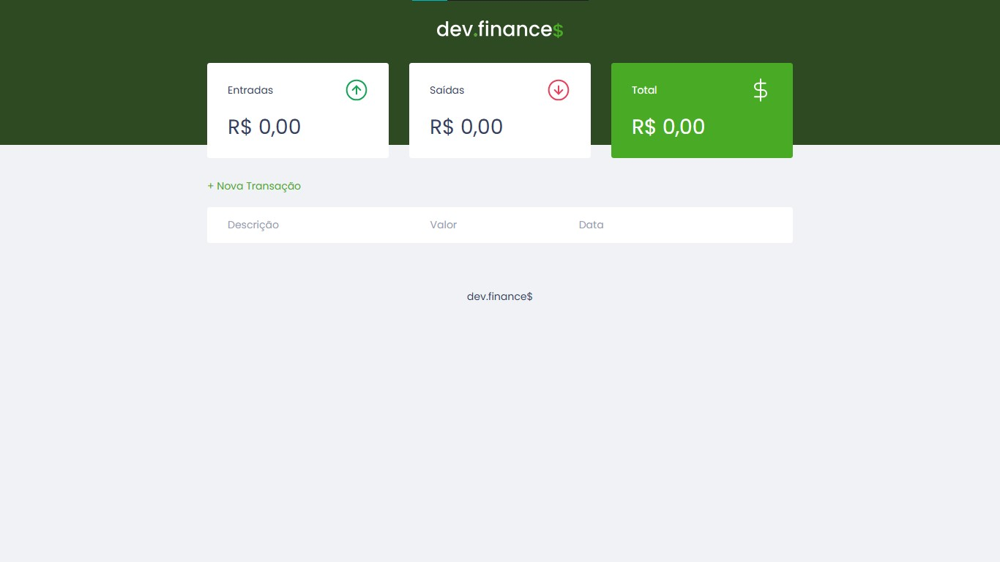

# 📌 codigo-final-maratona-discover

Uma plataforma que organiza as finanças do usuário.

---

## 🔗 Acesso ao projeto

[🔗 Clique aqui para acessar](https://luis-hans.github.io/codigo-final-maratona-discover/)

---

## 🎯 Funcionalidades

- [x] Calcula as despezas do usuário.
- [x] Mostra se está tendo lucro ou prejuízo.
- [x] Interface simples.
- [x] Armazenar no Local Storage.

---

## 🖼️ Preview



---

## 🚀 Tecnologias utilizadas

- HTML.
- CSS.
- JavaScript.

---

## ⚙️ Como usar

```bash
# Clone o repositório
git clone https://github.com/Luis-hans/codigo-final-maratona-discover

# Acesse a pasta do projeto
cd codigo-final-maratona-discover

# Abra o arquivo index.html no navegador
```

---

## 📚 Aprendizados

- [x] Fucionalidades do HTML/CSS. 
- [x] Usar o Local Storage com JavaScript.

---

## 🧾 Licença

Este projeto está sob a licença MIT. Sinta-se à vontade para usar, modificar e compartilhar!

---

## 🤝 Contato

Feito por Luís Henrique  
📬 luishenrique.lhans@gmail.com  
🐙 https://github.com/Luis-hans
